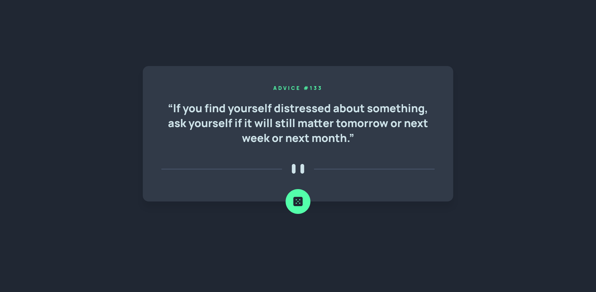

# Advice Generator

My solution to the **Advice Generator** challenge on [Frontend Mentor](https://www.frontendmentor.io/)

## Project Specifications

-  Fetch advice from the [Advice Slip API](https://api.adviceslip.com/)
-  Display a new piece of advice when the dice button is clicked
-  Prevent the same advice from being displayed twice
-  Skip advice that isn't formatted correctly in the API

Live Site URL: https://fadiyousif.github.io/advice-generator/

